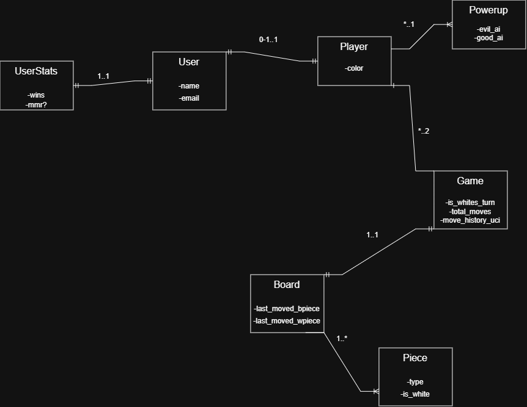

## Baby steps

This week I've been pondering how the relations needs to be and how much of the API needs to be on a database VS only existing in the java backend. For now I've made a first draft domain model and have begun to create some entities and are now sweating over implementing the new JPA we've learned. I hopefully will never forget why making an equals method is extremely important when testing entities with relations to other entities.
Some important notes on this weekends work:
- I've decided to make it so when a new user is created, the program will automatically create an associated OneToOne UserStats table. That decision also made me realize I shouldn't create a populator for the UserStats when testing, because I'm basically testing something that would never happen (waste of time).
- I've renamed my PowerUp class to PlayerPowerUp to avoid confusion later, because a basic PowerUp is just an enum containing the type, the powerup I need to persist is always associated with a player and a game.
- After a scour online and a chat with Claude it seems like rethinking the move logic of the game is necessary. Previously I just had a Position enum containing a name i.e E6 that then contained two Integer values, which symbolized the rank and file values 1-8 (using a service class I build that converted the rank and file values to pixels). For this project I will need to persist moves otherwise I can't see how it can be played by two players online. Also the chess engine Stockfish I'm planning on implementing only uses String values to scan the entire board state i.e "e3e4, h2g6" maybe I can too.
-I had a chat with a teacher too and he gave me a good idea, which is to implement a spectator mode which sounds like fun practise. The only issue I can see now is I have to think about what the spectator will be in the program. Right now a Game contains two players with different colors, so maybe I can add a third spectator color or a boolean value or maybe it doesn't need to be a player at all.

